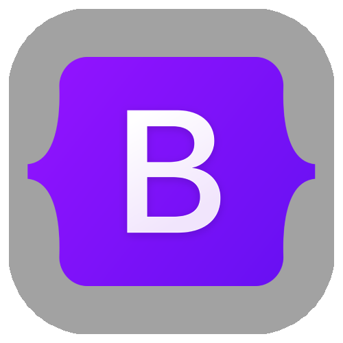
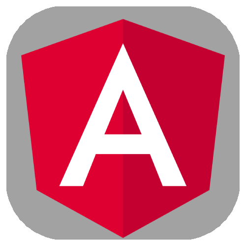
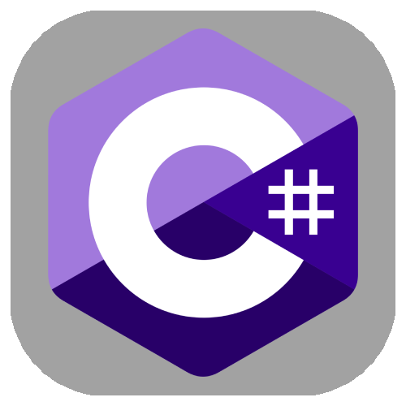
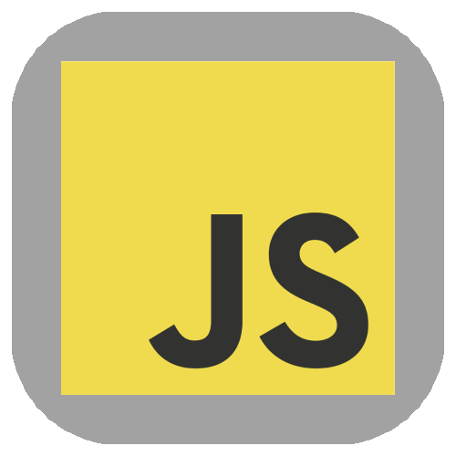
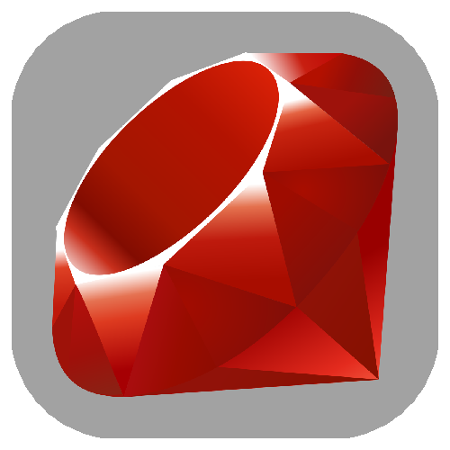
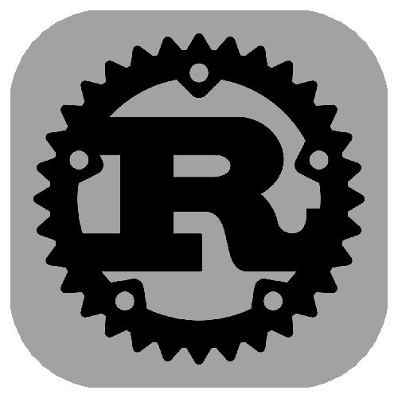
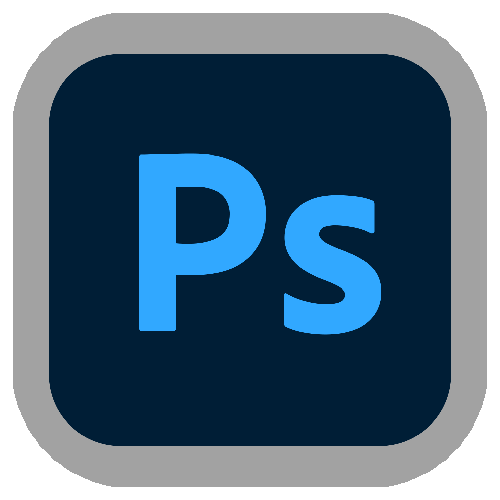
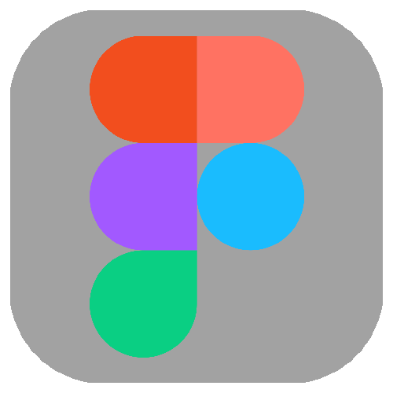

<h1> Hello ! I'm Raphaël . . .</h1>

## Summary

- [About Me](#lets-talk-about-me)
- [Skills](#the-skills-i-learned)
- [Projects](#list-of-project)
- [Reach Me](#way-to-reach-me)

## Let's Talk About Me

### Quick Presentation

     • I'm Raphaël a French student in IT 
    • I speak fluently English and French 
    • 18 years old, passionate for 10 years

--- 

### What I like 

     • Developing project (personal or not)
    • Music. . . I love it in all shapes and kind
    • Obviously Coffee and Tea (I'm a dev after all)

 

## The Skills I Learned 

<h3 align='center'>↓ Web Developement ↓</h3>

    
    
    
    
    
    

<h4 align='center'>↓ Learning List ↓</h4>

    
    
    
    

--- 

<h3 align='center'>↓ Programing Language ↓</h3>

    
    
    
    

<h4 align='center'>↓ Learning List ↓</h4>

    
    
    
    

--- 

<h3 align='center'>↓ Other Skill ↓</h3>

    
    
    
    

---

## List of Project

- [Discussion and Form Manager](https://github.com/raphael-tlm/atpc_Service.git)

 
 
<!-- Temporary  -->
 
 

--- 
## Way to Reach Me

 
 

- [X (twitter)]() *soon*
- [LinkedIn]() *let me make it good*
- [Instagram]() *soon*
